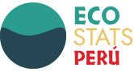

# 
 Eco Stats Peru      

[english](#english) - [spanish](#español)

## What is it?

Eco Stats Peru is a website aims to list solutions and show data that raise awareness about how Peruvians are influencing our environment, how we impact its resources and how we influence climate change, based on open data.

## Getting Started

Clone the repository.

Install Dependencies with `npm install`.

After dependencies installed, you can run:

`npm start`

Runs the app in the development mode.\
Open [http://localhost:3000](http://localhost:3000) to view it in the browser.

The page will reload if you make edits.\
You will also see any lint errors in the console.

`npm run build`

Builds the app for production to the `build` folder.\
It correctly bundles React in production mode and optimizes the build for the best performance.

The build is minified and the filenames include the hashes.\

App is ready!

See the section about [deployment](https://facebook.github.io/create-react-app/docs/deployment) for more information.

## License

This project is licensed under the MIT LiCense

MIT License

Copyright (c) 2020 Leví Arista Sánchez

Permission is hereby granted, free of charge, to any person obtaining a copy
of this software and associated documentation files (the "Software"), to deal
in the Software without restriction, including without limitation the rights
to use, copy, modify, merge, publish, distribute, sublicense, and/or sell
copies of the Software, and to permit persons to whom the Software is
furnished to do so, subject to the following conditions:

The above copyright notice and this permission notice shall be included in all
copies or substantial portions of the Software.

THE SOFTWARE IS PROVIDED "AS IS", WITHOUT WARRANTY OF ANY KIND, EXPRESS OR
IMPLIED, INCLUDING BUT NOT LIMITED TO THE WARRANTIES OF MERCHANTABILITY,
FITNESS FOR A PARTICULAR PURPOSE AND NONINFRINGEMENT. IN NO EVENT SHALL THE
AUTHORS OR COPYRIGHT HOLDERS BE LIABLE FOR ANY CLAIM, DAMAGES OR OTHER
LIABILITY, WHETHER IN AN ACTION OF CONTRACT, TORT OR OTHERWISE, ARISING FROM,
OUT OF OR IN CONNECTION WITH THE SOFTWARE OR THE USE OR OTHER DEALINGS IN THE
SOFTWARE.

---

## ¿Qué es?

Eco Stats Perú es un sitio web que tiene como objetivo mostrar datos que concienticen sobre cómo los peruanos estamos influyendo en nuestro entorno, cómo impactamos sus recursos y cómo influimos en el cambio climático, basado en datos abiertos.

## Empezando

Clona el repositorio.

Instala las dependencias con `npm install`.

Después de instalar las dependencias, se puede ejecutar:
### `npm start`

Ejecuta la aplicación en modo de desarrollo.\
Abre [http://localhost:3000](http://localhost:3000) para verlo en el navegador.

La página se volverá a cargar si realiza modificaciones.\
También verá errores de pelusa en la consola.

### `npm ejecutar compilación`

Construye la aplicación para producción en la carpeta `build`.\
Agrupa correctamente React en el modo de producción y optimiza la compilación para obtener el mejor rendimiento.

La compilación es minimizada y los nombres de archivo incluyen los hash.\

¡La aplicación está lista!

Para obtener más información consulte la sección sobre [implementación](https://facebook.github.io/create-react-app/docs/deployment).

## Licencia

Copyright (c) 2020 Leví Arista Sánchez

Por la presente se concede permiso, libre de cargos, a cualquier persona que obtenga una copia de este software y de los archivos de documentación asociados (el "Software"), a utilizar el Software sin restricción, incluyendo sin limitación los derechos a usar, copiar, modificar, fusionar, publicar, distribuir, sublicenciar, y/o vender copias del Software, y a permitir a las personas a las que se les proporcione el Software a hacer lo mismo, sujeto a las siguientes condiciones:

El aviso de copyright anterior y este aviso de permiso se incluirán en todas las copias o partes sustanciales del Software.

EL SOFTWARE SE PROPORCIONA "COMO ESTA", SIN GARANTÍA DE NINGÚN TIPO, EXPRESA O IMPLÍCITA, INCLUYENDO PERO NO LIMITADO A GARANTÍAS DE COMERCIALIZACIÓN, IDONEIDAD PARA UN PROPÓSITO PARTICULAR E INCUMPLIMIENTO. EN NINGÚN CASO LOS AUTORES O PROPIETARIOS DE LOS DERECHOS DE AUTOR SERÁN RESPONSABLES DE NINGUNA RECLAMACIÓN, DAÑOS U OTRAS RESPONSABILIDADES, YA SEA EN UNA ACCIÓN DE CONTRATO, AGRAVIO O CUALQUIER OTRO MOTIVO, DERIVADAS DE, FUERA DE O EN CONEXIÓN CON EL SOFTWARE O SU USO U OTRO TIPO DE ACCIONES EN EL SOFTWARE.
